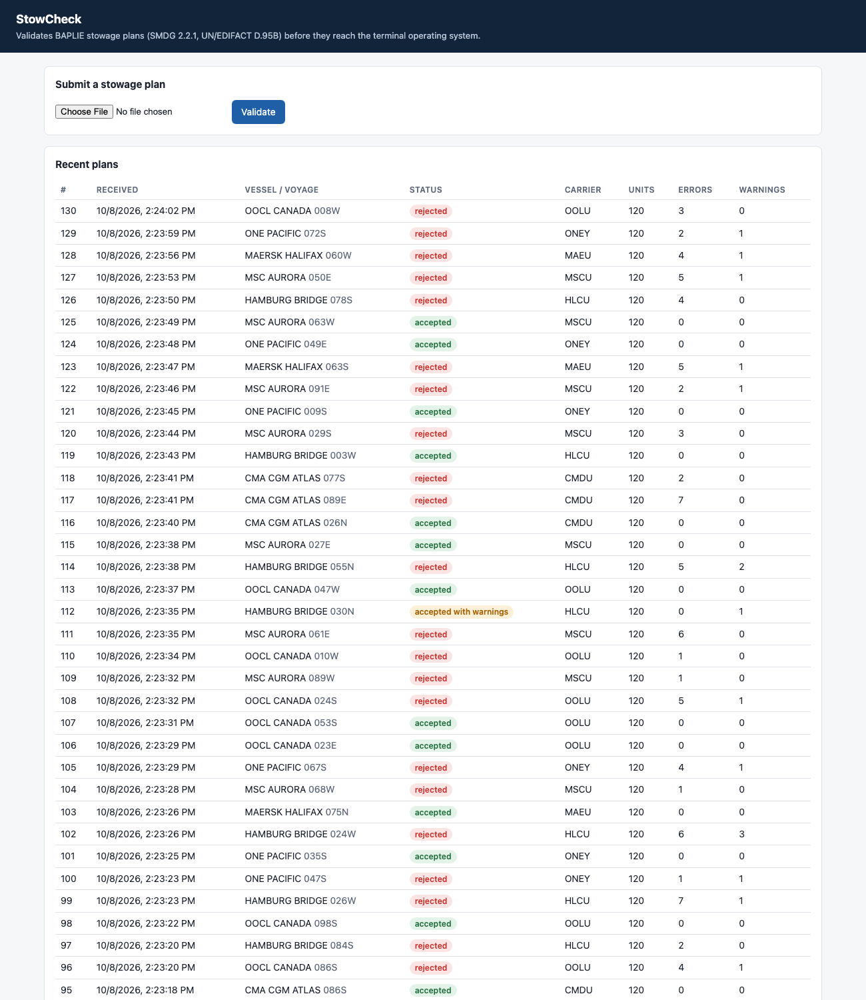
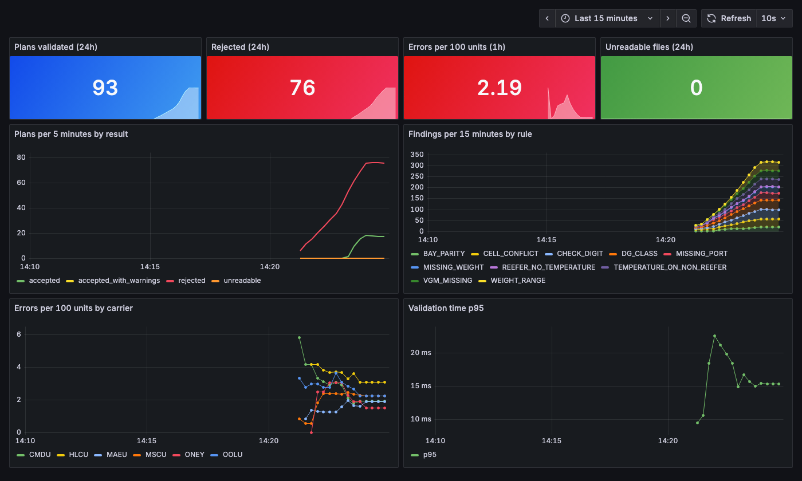

# StowCheck

Validation service for **BAPLIE** stowage plans, the EDIFACT message a shipping line
sends a container terminal before a vessel arrives. It lists every container on board,
where it sits (bay, row, tier), what it weighs, where it gets discharged, and whether it
is a reefer or carries dangerous goods.

Terminal planners load that file into their terminal operating system (TOS). When the
file is wrong (a typo in a container number, two boxes in one cell, a missing weight),
the error surfaces later as a rehandle, an idle crane, or a box nobody can find.
StowCheck catches those problems at the door, explains each one in plain language, and
tracks error rates per shipping line so the bad senders are visible.

Built to the **SMDG BAPLIE 2.2.1** user manual (UN/EDIFACT D.95B).





## What it does

- **Parses EDIFACT** from scratch: separators, the `UNA` service string, the `?` release
  character, wrapped lines.
- **Validates** each plan against these rules:

  | Rule | Severity | What it catches |
  |---|---|---|
  | `CHECK_DIGIT` / `CONTAINER_FORMAT` | error | Container numbers failing ISO 6346 |
  | `DUPLICATE_CONTAINER` | error | One container stowed in two cells |
  | `CELL_CONFLICT` | error (warning for flat racks) | Two units in one cell |
  | `CELL_FORMAT` | error | Cell not in bay-row-tier format |
  | `BAY_PARITY` | error / warning | 40ft unit in an odd bay, 20ft in an even bay |
  | `MISSING_WEIGHT` / `WEIGHT_RANGE` | error | No gross mass, or above the configured limit |
  | `VGM_MISSING` | warning | Full container without a verified gross mass (SOLAS) |
  | `TEMPERATURE_ON_NON_REEFER` | error | Set point on a dry box |
  | `REEFER_NO_TEMPERATURE` | warning | Full reefer with no set point (would run as a dry reefer) |
  | `DG_CLASS` / `DG_UN_NUMBER` | error / warning | Invalid IMDG class, missing UN number |
  | `MISSING_PORT` / `PORT_CODE` | error / warning | No load or discharge port, non UN/LOCODE |
  | `ENVELOPE` / `MESSAGE_TYPE` | error | UNT segment count or references don't match |

- **Compares plan versions**: preliminary against final, showing containers added,
  removed, moved, re-weighed, or re-routed.
- **Draws the bay plan** in the browser with problem cells highlighted.
- **Exports metrics** to Prometheus (plans by result, findings by rule and carrier,
  validation time). A provisioned Grafana dashboard and two alert rules come with it.

## Run it

Local, with in-memory H2 (needs Java 21+):

```bash
./mvnw spring-boot:run
# open http://localhost:8080
```

Full stack with PostgreSQL, Prometheus and Grafana:

```bash
docker compose up -d --build
python3 tools/generate_baplie.py --post http://localhost:8080/api/plans \
    --count 60 --units 120 --error-rate 0.005 --interval 3
```

| | URL |
|---|---|
| App | http://localhost:8080 |
| Grafana dashboard | http://localhost:3002 |
| Prometheus | http://localhost:9092 |

## API

| Method | Path | |
|---|---|---|
| `POST` | `/api/plans` | Submit a plan as `text/plain` body or a `file` multipart upload. Returns `201` with the report, `422` if the text is not EDIFACT |
| `GET` | `/api/plans` | Latest 50 runs |
| `GET` | `/api/plans/{id}` | Summary and findings |
| `GET` | `/api/plans/{id}/cells` | Every occupied cell with its findings |
| `GET` | `/api/plans/{from}/diff/{to}` | Changes between two plan versions |
| `GET` | `/actuator/prometheus` | Metrics |

```bash
curl -X POST -H 'Content-Type: text/plain' --data-binary @src/test/resources/plans/broken-plan.edi \
     http://localhost:8080/api/plans
```

## Test data

All data is synthetic. `tools/generate_baplie.py` builds plans with realistic stacking
(40ft stacks in even bays, paired 20ft stacks in odd bays, nothing floating), valid
ISO 6346 check digits, reefers and dangerous goods, and injects errors at a chosen rate.
`--seed` makes the output repeatable.

```bash
python3 tools/generate_baplie.py --units 150 --seed 1 > clean.edi
python3 tools/generate_baplie.py --units 150 --error-rate 0.05 --seed 2 > dirty.edi
```

## Tests

```bash
./mvnw test
```

Covers the tokenizer (UNA, release character, malformed input), the parser (header
fields, unit conversion), the ISO 6346 check digit against the standard's worked
example, every rule against a fixture with one planted error each, the plan diff, and
the REST API end to end.

## Layout

```
edifact/     tokenizer: raw text to segments
baplie/      parser: segments to a StowagePlan of StowedUnits
validation/  Rule interface, one class per rule family, PlanValidator runs them all
plan/        persistence, metrics, plan diff
api/         REST controller and JSON shapes
static/      single-page UI with the bay plan view
tools/       synthetic BAPLIE generator
ops/         Prometheus scrape and alert config, Grafana dashboard
```

## Not covered yet

- BAPLIE 3.x (D.13B) and MOVINS
- Stack weight limits and dangerous-goods segregation, which need vessel profile data
- Out-of-gauge (DIM) and break-bulk validation
- Pushing validated plans on to a TOS
